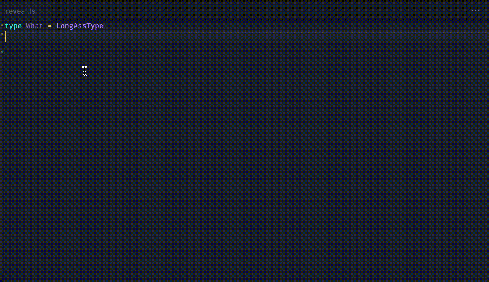

# ts-reveal-types README

If you have problems inspecting complex types from the compact hover tooltip, this extension is for you.

Opens a live view of the type declarations in your file, formatted and in expanded form (no '[...]' truncation).



## Features

It will reveal any type declarations on your file, and update if you change it.

### Reveal an interface

Just spread the interface into a type declaration:

```ts
type Revealed = {
  [K in keyof MyInterface]: [MyInterface[K]]
}
```

### Reveal type of a variable

Use `typeof` and assign to a type declaration

```ts
type Revealed = typeof myVar
```
